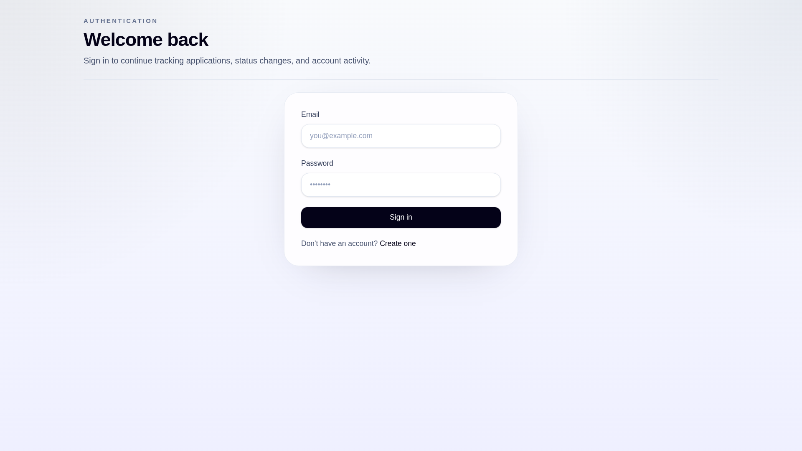
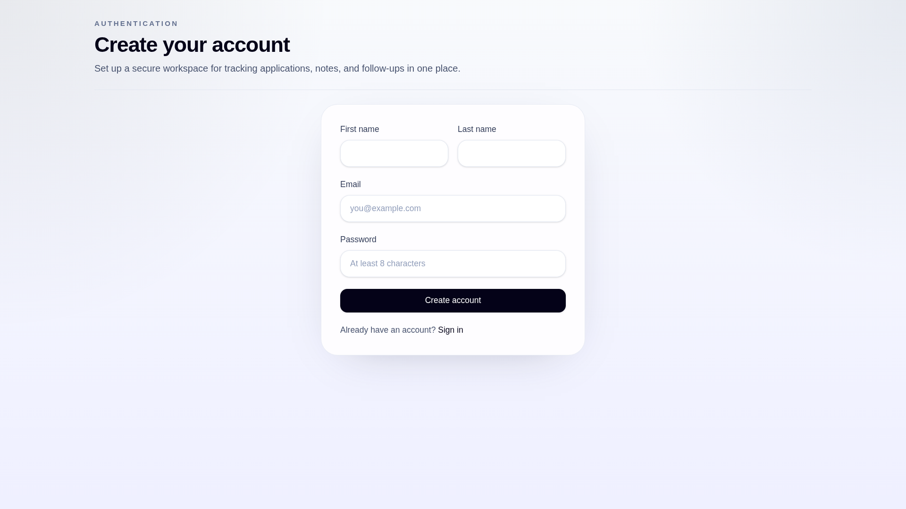
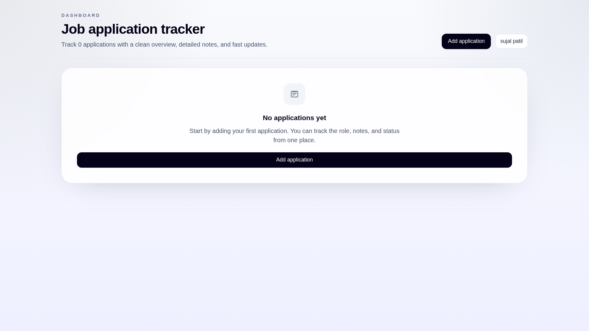
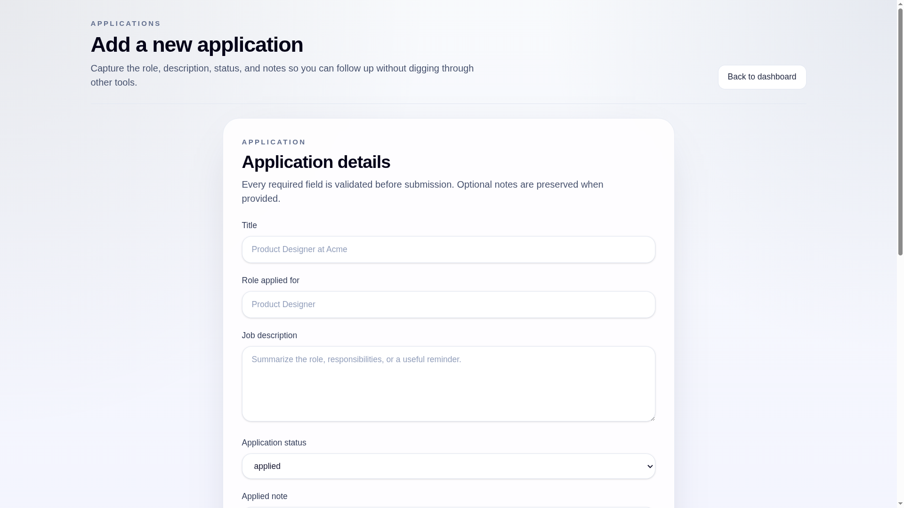
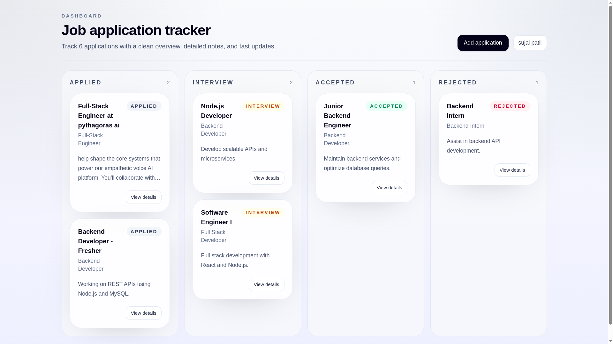
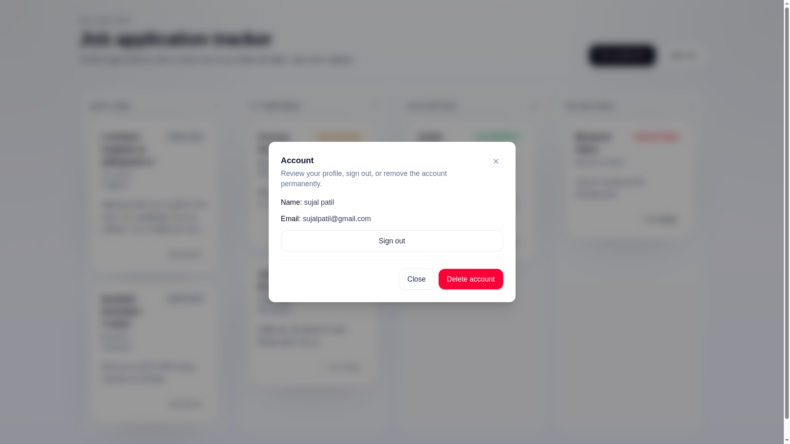
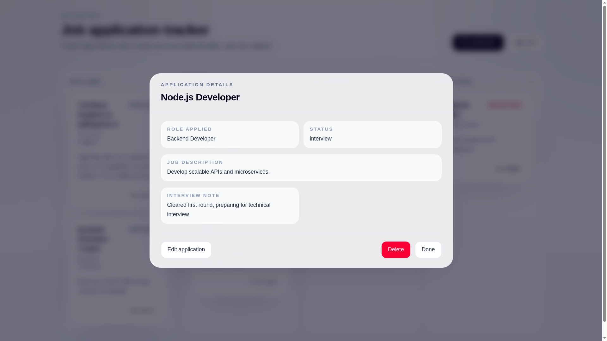
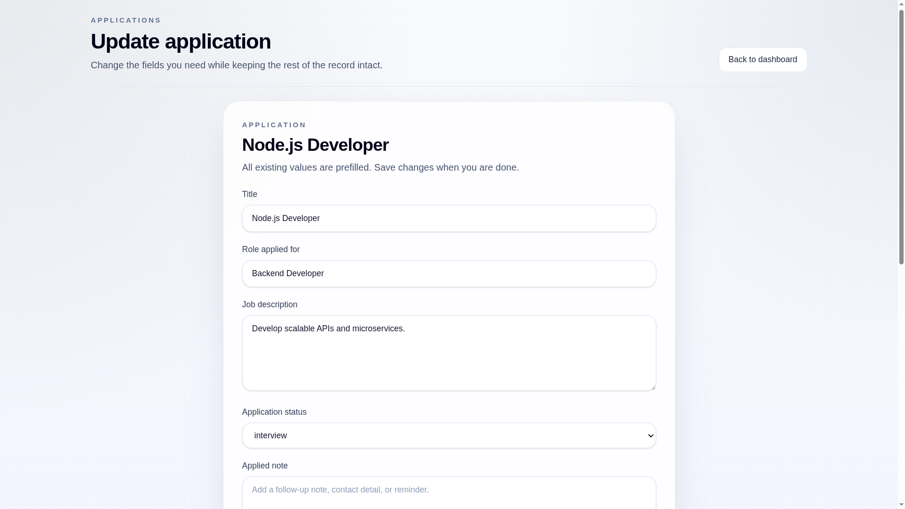

<div align="center">

# 📋 Job Application Tracker (JAT)

**A full-stack web app to organize, track, and manage your job hunt — end to end.**

Built with React, Node.js/Express, and MySQL

</div>

---

## 🧭 What is this?

Job hunting means juggling dozens of applications across different companies, stages, and deadlines — and it's easy to lose track of what's happening where. **Job Application Tracker (JAT)** solves that by giving you one clean dashboard to log every application, see its status at a glance, and update it as things progress — no more spreadsheets or sticky notes.

---

## ✨ Features (for everyone)

- **Personal Account** — Sign up and log in securely; your data is private to you.
- **Add Applications** — Log every job you apply to: company, role, and status.
- **Visual Dashboard** — Applications are organized into columns — *Applied*, *Interview*, *Accepted*, *Rejected* — like a Kanban/to-do board.
- **Drag-and-Drop Status Updates** — Just drag a card to a new column as your application progresses.
- **Edit & Delete** — Update details or remove applications you no longer need to track.
- **Secure by Design** — Your login session is protected, and only you can see or edit your own applications.
- **Account Control** — Delete your account and all associated data whenever you want.

---

## 📸 Screenshots

<table>
  <tr>
    <td align="center"><b>Sign In</b><br/></td>
    <td align="center"><b>Create Account</b><br/></td>
  </tr>
  <tr>
    <td align="center"><b>Empty Dashboard</b><br/></td>
    <td align="center"><b>Add Application</b><br/></td>
  </tr>
  <tr>
    <td align="center"><b>Kanban Dashboard</b><br/></td>
    <td align="center"><b>Account Modal</b><br/></td>
  </tr>
  <tr>
    <td align="center"><b>Application Details</b><br/></td>
    <td align="center"><b>Update Application</b><br/></td>
  </tr>
</table>

---

## 🛠️ Technical Overview (for developers)

### Tech Stack

| Layer | Technologies |
|---|---|
| **Frontend** | React 19, Vite, React Router, Tailwind CSS, React Compiler |
| **Backend** | Node.js, Express, JWT, bcrypt, Zod, express-rate-limit |
| **Database** | MySQL 8.4 (via `mysql2`) |
| **Testing** | Jest |
| **Infrastructure** | Docker, Docker Compose |

### Architecture

- **Frontend** — React + Vite SPA with protected routes, a Kanban-style dashboard, and bulk-fetch data loading.
- **Backend** — Modular Express API (routes → controllers → queries → schemas) with clear separation of concerns.
- **Database** — MySQL with parameterized, injection-safe queries via `mysql2`.
- **Auth** — JWT stored in an `httpOnly` cookie; passwords hashed with `bcrypt`.
- **Validation** — All request payloads validated with strict Zod schemas.
- **Rate Limiting** — Separate limiters for auth routes vs general application routes.

### Folder Structure

```text
.
├── Backend/
│   ├── config/          # Environment config
│   ├── controllers/      # Request handlers
│   ├── db/                # MySQL pool + schema
│   ├── middleware/        # Rate limiting, validation, auth checks
│   ├── queries/           # Parameterized SQL queries
│   ├── routes/            # Express routers
│   ├── schemas/           # Zod validation schemas
│   ├── utils/             # Cookie/JWT/error helpers
│   └── index.js           # App entry point
├── Frontend/
│   ├── src/
│   │   ├── components/    # Reusable UI components
│   │   ├── hooks/         # Custom React hooks
│   │   ├── lib/           # API client
│   │   ├── pages/         # Route-level pages
│   │   └── utils/         # Helper functions
│   └── vite.config.js
└── docker-compose.yml
```

### API Endpoints

| Method | Path | Auth | Description |
|---|---|---|---|
| GET | `/` | — | Health check |
| POST | `/user/register` | — | Register a new user |
| POST | `/user/login` | — | Log in, sets auth cookie |
| POST | `/user/logout` | — | Clears auth cookie |
| GET | `/user/me` | ✅ | Verify current session |
| DELETE | `/user/me` | ✅ | Delete account (password required) |
| GET | `/application` | ✅ | List all applications |
| POST | `/application` | ✅ | Create an application |
| PUT | `/application/:id` | ✅ | Update an application |
| DELETE | `/application/:id` | ✅ | Delete an application |
| PATCH | `/application/:id/status` | ✅ | Update application status |

### Security Measures

- Passwords hashed with `bcrypt`
- JWT auth stored in `httpOnly` cookies with `sameSite`/`secure` flags based on environment
- Strict Zod validation on all inputs
- Rate limiting on auth and application routes
- Parameterized SQL (no injection risk)
- `helmet` + CORS configured on the Express app

---

## 🚀 Getting Started

### Prerequisites

- Node.js 18+
- npm
- MySQL-compatible database (or Docker)

### Run with Docker (recommended)

```bash
docker compose up --build
```

This spins up the MySQL database, backend API, and frontend dev server together.

### Manual Setup

**Backend**
```bash
cd Backend
npm install
cp .env.example .env
npm start
```

**Frontend**
```bash
cd Frontend
npm install
cp .env.example .env
npm run dev
```

### Environment Variables

**Backend (`Backend/.env.example`)**

| Variable | Description | Required |
|---|---|---|
| `SECRET_KEY` | JWT signing secret | ✅ |
| `PORT` | Server port (default `8000`) | ❌ |
| `CLIENT_URL` | Allowed frontend origin for CORS | ✅ |
| `DB_HOST` | MySQL host | ✅ |
| `DB_USER` | MySQL user | ✅ |
| `DB_PASSWORD` | MySQL password | ✅ |
| `DB_DATABASE` | MySQL database name | ✅ |

**Frontend (`Frontend/.env.example`)**

| Variable | Description | Required |
|---|---|---|
| `VITE_API_URL` | Base URL for the backend API | ✅ |

---

## 🗺️ Roadmap

- [ ] Continue polishing the React/Vite frontend for production
- [ ] Add automated test coverage for edge cases

---

<div align="center">

Built by **Sujal Patil** · [Portfolio](https://sujalpatil.dev) · [GitHub](https://github.com/Sujal-s-patil)

</div>